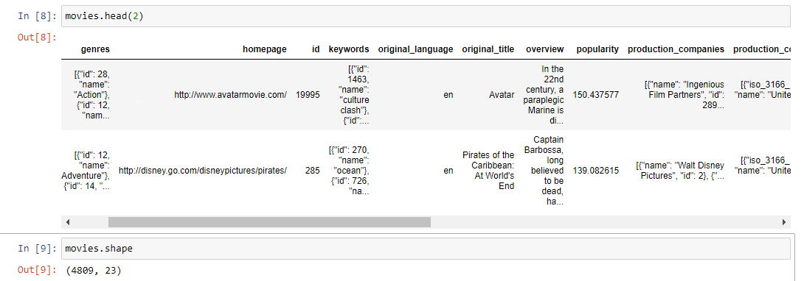
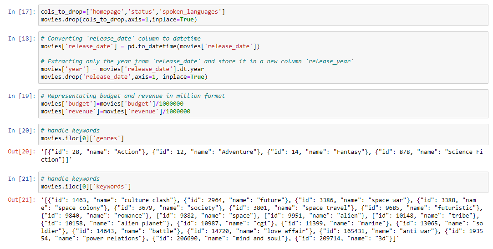
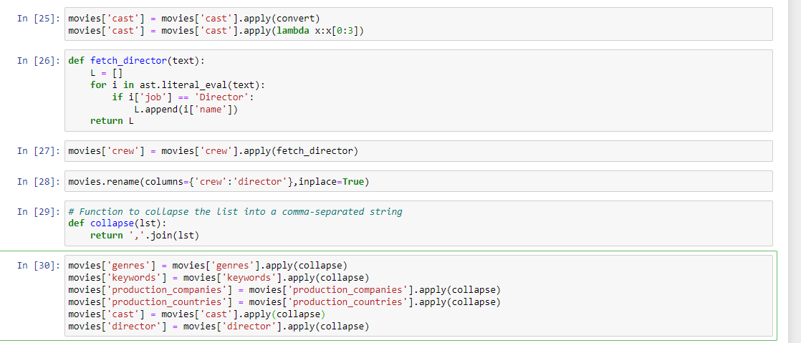
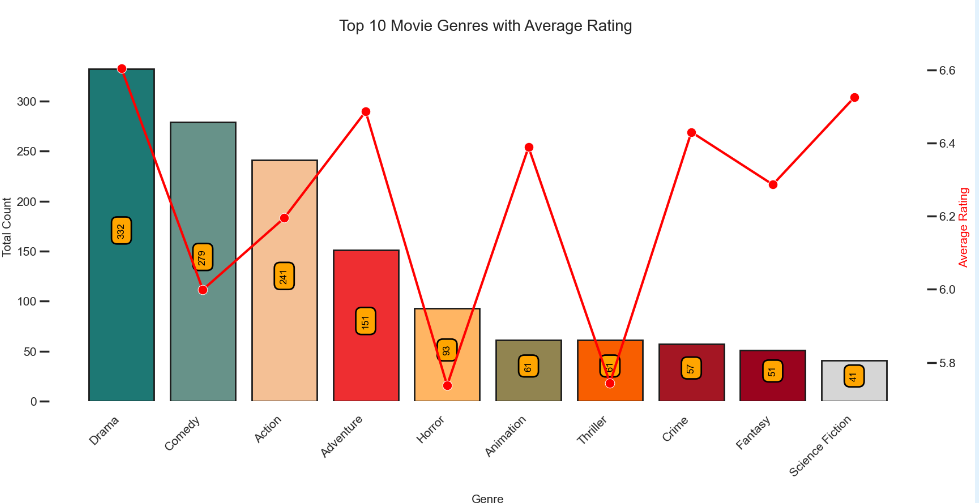
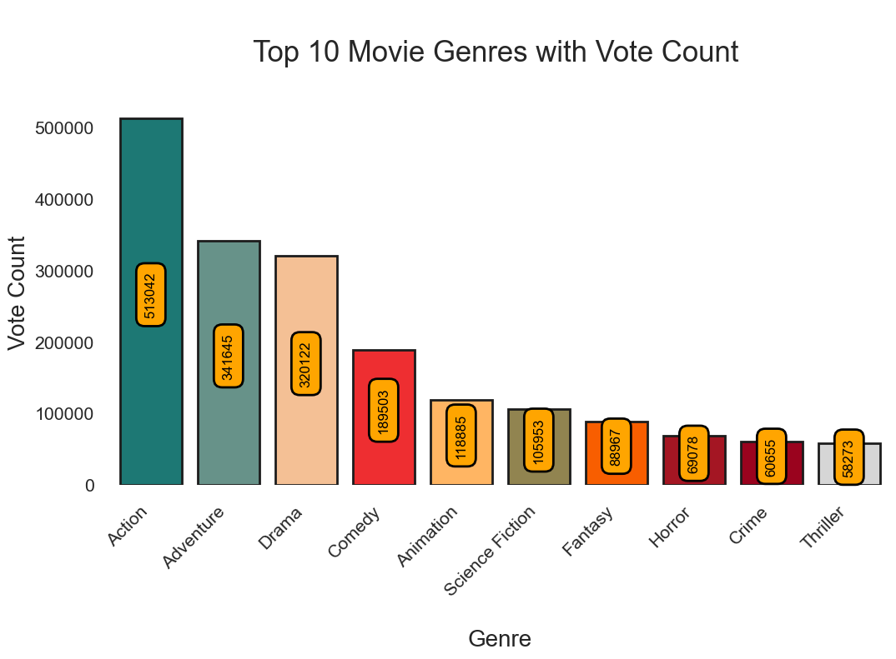
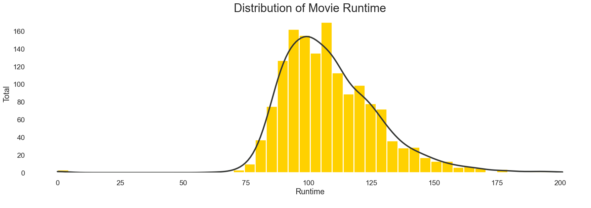

# Movie Recommender System 


Movies are a significant part of our culture and entertainment landscape. Understanding what makes a movie successful, whether in terms of revenue, critical acclaim, or audience engagement, is a compelling area of exploration. The __"TMDB 5000 Movie Dataset"__ offers a treasure trove of data that allows us to dive deep into the world of cinema.

In this project, we will harness the power of data to create a movie recommendation system. Our approach will be content-based, which means we will analyze the inherent characteristics and features of movies to make personalized recommendations. By examining metadata such as movie genres, cast and crew, and keywords, we aim to build a system that suggests movies based on their content similarities.

### Meta Data of Columns:

To develop our content-based movie recommendation system, we will utilize various columns from the TMDB 5000 Movie Dataset. Here's a brief overview of the key columns and their metadata:

- __Title:__ The title of the movie.
- __Release Date:__ The date when the movie was released.
- __Budget:__ The budget allocated for producing the movie.
- __Revenue:__ The revenue generated by the movie at the box office.
- __Popularity:__ A metric indicating the movie's popularity on the TMDB platform.
- __User Ratings:__ Average user ratings for the movie.
- __Genres:__ The genre(s) associated with the movie (e.g., Action, Drama, Comedy).
- __Cast:__ Information about the actors and actresses in the movie.
- __Crew:__ Details about the film's director, producer, and other crew members.
- __Keywords:__ Keywords or phrases associated with the movie's plot or themes.
- __Production Companies:__ Names of production companies involved in making the movie.
- __Production Countries:__ Countries where the movie was produced.


#### Dataset is taken from Kaggle 

🔧 Built with
- streamlit
- Python 3.8
- Machine learning
- Scikit learn
- 🏦 Industrial Use Cases

<br>


# Dataset has been used:

* [Dataset link](https://www.kaggle.com/tmdb/tmdb-movie-metadata?select=tmdb_5000_movies.csv)


### Setting up Project Environment :

This project is a separate project using Conda of Anaconda. It provides a clear structure for organizing your code and dependencies using a virtual environment. The project includes the following folders and files:

- artifacts/: This folder is used to store any generated artifacts, such as trained models or processed datasets.
- Notebooks/: This folder is used to store Jupyter notebooks for data exploration or experimentation.
- src/: This folder contains the source code of your project.
- environment/: This folder is used to store the virtual environment created by Conda.
- .gitignore: This file specifies which files and folders should be ignored by Git.
- application.py: This is the main Flask application file.
- setup.py: This file contains the configuration for packaging your project as a Python package.
- demo : Contain Images of Notebook.

#### Getting Started

To set up the project, please follow the instructions below:

##### Prerequisites

- Anaconda or Miniconda should be installed on your system.
- Installation
- Clone the project repository:
```
git clone <repository_url>
cd <project_directory>
```

- Create a new Conda environment for the project:
```
conda create --name <env_name> python=3.9
```
- Activate the newly created environment:
```
conda activate <env_name>
```
- Install the project dependencies:

```
pip install -r requirements.txt
```
- Running the Application

Make sure you are in the project directory and the Conda environment is activated.

#### Start the streamlit application:

```
'streamlit run app.py' 

```
Open a web browser and visit http://localhost:5000 to access the application.

#### Additional Notes

- Having a separate project environment, such as the one created with Conda, offers several advantages:

- Dependency Isolation: By creating a virtual environment, you can install project-specific dependencies without interfering with the system-wide Python installation or other projects on your machine.

- Reproducibility: The project environment ensures that all project contributors are using the same set of dependencies, making it easier to reproduce and share the project's results.

- Version Control: By including the virtual environment in your project repository, you can easily recreate the same environment on different machines or after a fresh clone of the repository.

- Package Management: Using setup.py allows you to define the project's dependencies and make it easier to package and distribute your project as a Python package.

- By following these instructions and organizing your project with a separate environment, you can maintain a clean and reproducible development environment while keeping your project dependencies isolated and well-managed.

<br>


## Importance of Recommendation System

Recommendation systems are becoming increasingly important in today’s extremely busy world. People are always short on time with the myriad tasks they need to accomplish in the limited 24 hours. Therefore, the recommendation systems are important as they help them make the right choices, without having to expend their cognitive resources.

The purpose of a recommendation system basically is to search for content that would be interesting to an individual. Moreover, it involves a number of factors to create personalised lists of useful and interesting content specific to each user/individual. Recommendation systems are Artificial Intelligence based algorithms that skim through all possible options and create a customized list of items that are interesting and relevant to an individual. These results are based on their profile, search/browsing history, what other people with similar traits/demographics are watching, and how likely are you to watch those movies. This is achieved through predictive modeling and heuristics with the data available.

# Types of Recommendation System :

### 1 ) Content Based :

- Content-based systems, which use characteristic information and takes item attriubutes into consideration .

- Twitter , Youtube .

- Which music you are listening , what singer are you watching . Form embeddings for the features .
	
- User specific actions or similar items reccomendation .
	
- It will create a vector of it .
	
- These systems make recommendations using a user's item and profile features. They hypothesize that if a user was interested in an item in the past, they will once again be interested in it in the future
	
- One issue that arises is making obvious recommendations because of excessive specialization (user A is only interested in categories B, C, and D, and the system is not able to recommend items outside those categories, even though they could be interesting to them).

### 2 ) Collaborative Based :
		
- Collaborative filtering systems, which are based on user-item interactions.
	
- Clusters of users with same ratings , similar users .
	
- Book recommendation , so use cluster mechanism .
	
- We take only one parameter , ratings or comments .
	
- In short, collaborative filtering systems are based on the assumption that if a user likes item A and another user likes the same item A as well as another item, item B, the first user could also be interested in the second item . 
	
- Issues are :

	- User-Item nXn matrix , so computationally expensive .

	- Only famous items will get reccomended .

	- New items might not get reccomended at all .   

### 3 ) Hybrid Based :
	
- Hybrid systems, which combine both types of information with the aim of avoiding problems that are generated when working with just one kind.

- Combination of both and used now a days .

- Uses : word2vec , embedding .         

## EDA & Business Implication

EDA stands for exploratory data analysis where we explore our data and grab insights from it. EDA helps us in getting knowledge in form of various plots and diagrams where we can easily understand the data and its features.

### Observation

As you see our Dataset include 23 columns. 
<br>

<br>

#### Data Cleaning 

As I Also performn data cleaning steps , as some of the columns are messed up and :

 <br>
 <br>
 <br>

### Insights:

 <br>
- "Drama" is the most prevalent genre, with 332 movies, indicating its popularity.
- "Western" and "Documentary" genres have notably high average ratings, suggesting strong audience reception.
- The dataset includes 19 unique genres, showcasing genre diversity in movies.
- The combination of genre count and average rating can help assess a genre's success.
- "Adventure" movies have a relatively high average rating (6.49) and a moderate count (151 movies), indicating their potential popularity.
- Some genres, like "Western" and "War," have low counts but high average ratings, catering to niche audiences.


 <br>
- "Action" and "Adventure" dominate with the highest total vote counts.
- "Drama" remains popular, securing the third position.
- "Comedy" has a strong following with a substantial vote count.
- "Animation" ranks fifth, indicating its broad appeal.
- "Science Fiction" and "Fantasy" genres capture viewer interest.
- "Horror" surpasses genres like "Crime" and "Thriller."
- "Crime" and "Thriller" complete the top 10 list, highlighting suspenseful film preferences.


 <br>
- Maximum Film Runtime: 201.0 minutes
- Minimum Film Runtime: 0.0 minutes
- Average Film Runtime: 108.66 minutes


__To see further Analysis . Kindly open the Notebook__


# Streamlit Model Deployment

To provide a user-friendly interface, we have integrated the model into a Streamlit application. The Streamlit application serves as the front-end of the project, allowing users to interact with the trained model and make predictions based on their inputs.

The Streamlit application can be accessed by running the `app.py` file. It provides a web interface where users can input the required features, and the model will predict the price based on the provided information.


Using Streamlit for the front-end enables a seamless integration of the machine learning model into a user-friendly web application, enhancing the usability and accessibility of the project.

By following the steps outlined above and utilizing Streamlit for the front-end, you can effectively train a model to predict prices, incorporating feature selection, feature engineering, outlier detection, and a user-friendly interface.

# Concept used to build the model.pkl file : cosine_similarity

1 . Cosine Similarity is a metric that allows you to measure the similarity of the documents.

2 . In order to demonstrate cosine similarity function we need vectors. Here vectors are numpy array.

3 . Finally, Once we have vectors, We can call cosine_similarity() by passing both vectors. It will calculate the cosine similarity between these two.

4 . It will be a value between [0,1]. If it is 0 then both vectors are complete different. But in the place of that if it is 1, It will be completely similar.

5 . For more details , check URL : https://www.learndatasci.com/glossary/cosine-similarity/

### AUTHOR
<hr>
<strong>Shehryar Gondal</strong>


You can get in touch with me on my LinkedIn Profile:<br>
 <a href = "https://linkedin.com/in/shehryar-gondal-data-analyst"></a>

You can also follow my GitHub Profile to stay updated about my latest projects:<br>
<a href = "https://github.com/ShehryarGondal1"></a>


If you liked the repo then kindly support it by giving it a star ⭐.

